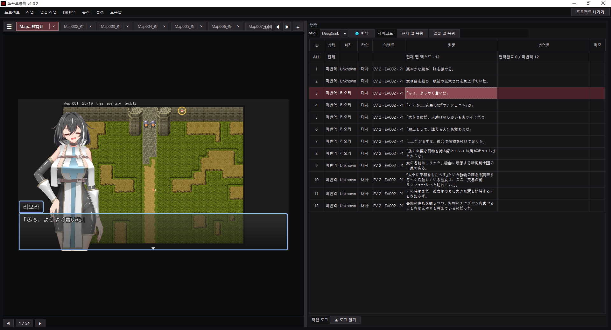

# YSB Game Editor

**YSB Game Editor** is a desktop viewer-editor for translating and reviewing RPG Maker game text data.

It is also known as **쯔꾸르붕이** in Korean.



---

## English

### What is YSB Game Editor?

YSB Game Editor is a desktop tool for people who want to translate RPG Maker games by hand or with AI assistance.

Instead of extracting scripts, translating them somewhere else, and then inserting them back into the game, YSB Game Editor opens the game project data directly and rebuilds it into a translation-focused workspace.

The goal is simple:

> Edit the game text, review the context, and check the visual result in one place.

YSB Game Editor is not just a text table editor.
It is designed as a translation viewer-editor that connects game data, dialogue tables, database text, speaker information, AI prompts, glossary data, and preview screens into one workflow.

---

### Core Concept

Typical RPG Maker translation workflows often look like this:

1. Extract text from the game files
2. Translate the text in a separate tool
3. Insert the translated text back into the game
4. Launch the game
5. Move to the correct map or scene
6. Check the result
7. Go back and fix the text again

YSB Game Editor tries to remove as much of that back-and-forth work as possible.

It rebuilds RPG Maker game data into a translator-friendly interface, so the user can edit dialogue while also checking where the line belongs, who says it, what database terms are involved, and how it may appear in the game.

---

### Main Features

* RPG Maker project loading and local workspace management
* Map-based tab interface for translated game text
* Table-based dialogue editing
* Database text editing mode
* Speaker/name extraction and speaker translation
* Character-specific prompt support
* Common prompt and database prompt management
* AI-assisted single-line and batch translation workflows
* Unified translation cleanup for repeated source text
* Automatic glossary-style use of database text
* Game display settings such as font, font size, fallback font, and window opacity
* Preview-oriented workflow for checking translated lines with game-like context
* Direct writeback to RPG Maker game JSON files
* Windows standalone build support

---

### What Makes It Different?

YSB Game Editor is built around workflow reduction.

Many translation tools focus mainly on extracting and replacing text.
YSB Game Editor focuses on the full translation loop:

> read game data → rebuild it into a translator interface → assemble AI context → translate → review → write back to the game

The tool is designed to reduce repeated manual steps such as switching between a text editor, spreadsheet, translation tool, RPG Maker editor, and the running game.

It also treats RPG Maker data as useful translation context.
Database entries, character names, speaker information, and repeated dialogue are not just raw text. They can be used to improve translation consistency and AI prompt quality.

---

### AI Translation Context

YSB Game Editor is designed with AI-assisted translation in mind.

AI translation quality depends heavily on context.
For RPG Maker games, that context often already exists inside the game data:

* character names
* speaker names
* item names
* skill names
* class names
* database descriptions
* repeated dialogue lines
* map and event locations

YSB Game Editor uses this structure to help the user manage prompts, glossary-like data, character-specific instructions, and unified translation cleanup.

The goal is not only to translate faster, but to make translated lines more consistent and easier to review.

---

### Build Notes

Development and build environment:

```bat
setup_venv.bat
check_env.bat
run.bat
build_tools\build_game_exe.bat
```

Python 3.11 is recommended and used as the fixed build/runtime environment.

---

### Status

YSB Game Editor is under active development.

The current version focuses on RPG Maker translation workflows, especially dialogue editing, database text editing, AI-assisted translation, speaker handling, and preview-based review.

Some UI details, file structures, and supported workflows may change in future versions.

---

## 한국어

### YSB Game Editor란?

**YSB Game Editor**는 RPG Maker 게임의 텍스트를 번역하고 검수하기 위한 데스크톱 뷰어-편집기입니다.

한국어 별칭은 **쯔꾸르붕이**입니다.

일반적인 번역 작업처럼 스크립트를 따로 추출하고, 다른 프로그램에서 번역하고, 다시 게임 파일에 붙여넣는 방식이 아니라, 게임 원본 데이터를 직접 열어서 번역 작업용 화면으로 다시 구성하는 것을 목표로 합니다.

핵심 목표는 단순합니다.

> 게임 텍스트를 수정하고, 문맥을 확인하고, 화면 표시까지 한곳에서 검수한다.

YSB Game Editor는 단순한 텍스트 표 편집기가 아닙니다.
게임 데이터, 맵 대사, 데이터베이스 텍스트, 화자 정보, AI 프롬프트, 단어장 후보, 프리뷰 화면을 하나의 작업 흐름으로 연결하는 번역자용 뷰어-편집기입니다.

---

### 핵심 아이디어

일반적인 RPG Maker 번역 작업은 보통 이런 흐름을 가집니다.

1. 게임 파일에서 텍스트를 추출한다
2. 별도 번역툴이나 표에서 번역한다
3. 번역문을 다시 게임 파일에 넣는다
4. 게임을 실행한다
5. 해당 맵이나 장면까지 이동한다
6. 결과를 확인한다
7. 어색하면 다시 돌아와서 수정한다

YSB Game Editor는 이 반복 동선을 줄이기 위해 만들어졌습니다.

게임 데이터를 번역자용 인터페이스로 다시 구성해서, 사용자가 대사를 수정하면서 동시에 해당 대사가 어느 맵에 있는지, 누가 말하는지, 어떤 데이터베이스 용어와 연결되는지, 게임 화면에서는 어떻게 보일지 확인할 수 있게 합니다.

---

### 주요 기능

* RPG Maker 프로젝트 불러오기 및 로컬 작업공간 관리
* 맵 기반 탭 인터페이스
* 표 기반 대사 편집
* 데이터베이스 텍스트 편집 모드
* 화자/이름 추출 및 화자 번역
* 캐릭터별 프롬프트 입력
* 공통 프롬프트 및 DB 프롬프트 관리
* AI 기반 개별 번역 및 일괄 번역
* 반복 원문 기준 번역 통일
* 데이터베이스 텍스트 기반 단어장/용어 관리 보조
* 게임 표시 설정 관리
* 폰트, 글자 크기, 대체 폰트, 창 투명도 설정
* 게임 화면에 가까운 프리뷰 기반 검수 흐름
* RPG Maker 게임 JSON 파일에 직접 반영
* Windows 단일 실행 파일 빌드 지원

---

### 무엇이 다른가?

YSB Game Editor의 핵심은 작업 동선을 줄이는 것입니다.

많은 번역 도구는 텍스트를 추출하고 다시 넣는 것에 집중합니다.
YSB Game Editor는 그보다 더 넓은 번역 루프를 다룹니다.

> 게임 데이터 읽기 → 번역자용 인터페이스로 재구성 → AI 컨텍스트 조립 → 번역 → 검수 → 게임 파일 반영

즉, 텍스트 편집기, 표 편집기, AI 번역기, RPG Maker 에디터, 게임 실행 검수 사이를 반복해서 오가는 작업을 줄이는 것이 목표입니다.

또한 RPG Maker 내부 데이터를 단순한 원문 목록으로 보지 않습니다.
데이터베이스, 화자, 캐릭터 이름, 스킬명, 아이템명, 반복 대사 등은 AI 번역 품질과 번역 통일성을 높이는 중요한 문맥 자료로 취급됩니다.

---

### AI 번역 컨텍스트

YSB Game Editor는 AI 번역을 염두에 두고 설계되었습니다.

AI 번역 품질은 문맥에 크게 영향을 받습니다.
RPG Maker 게임에서는 그 문맥이 이미 게임 데이터 안에 들어 있는 경우가 많습니다.

* 캐릭터 이름
* 화자 이름
* 아이템 이름
* 스킬 이름
* 직업 이름
* 데이터베이스 설명문
* 반복되는 대사
* 맵과 이벤트 위치

YSB Game Editor는 이런 정보를 번역 작업에 활용할 수 있도록 돕습니다.
공통 프롬프트, DB 프롬프트, 캐릭터별 프롬프트, 단어장 후보, 반복 번역 통일 기능을 통해 AI 번역의 흔들림을 줄이고 검수하기 쉬운 결과를 만드는 것이 목표입니다.

---

### 빌드 안내

개발 및 빌드 기본 흐름은 다음과 같습니다.

```bat
setup_venv.bat
check_env.bat
run.bat
build_tools\build_game_exe.bat
```

Python 3.11 환경을 기준으로 사용합니다.

---

### 개발 상태

YSB Game Editor는 현재 활발히 개발 중입니다.

현재 버전은 RPG Maker 번역 작업 흐름, 특히 맵 대사 편집, 데이터베이스 텍스트 편집, AI 번역, 화자 처리, 게임 화면 기반 검수 흐름에 초점을 맞추고 있습니다.

향후 버전에서 UI 구성, 파일 구조, 지원 작업 흐름은 변경될 수 있습니다.


## License

Copyright (c) 2026 amule949

All rights reserved.  
This project is currently published for development and review purposes.  
A formal license may be added later.